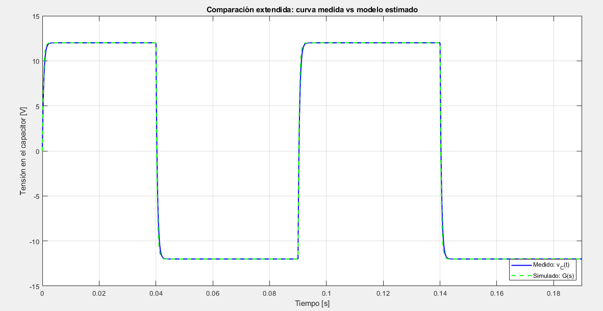
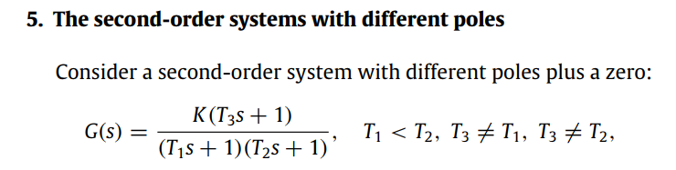
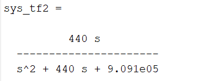
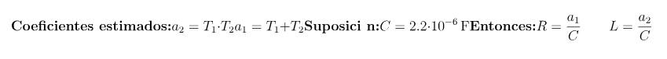

# Trabajo Práctico N°1 - Sistemas de Control II

## Tabla de contenidos
1. [Objetivo](#objetivo)

2. [Caso 1: Circuito RLC](#caso-1-circuito-rlc-2-variables-de-estado)
    - [A. Simulación con entrada tipo escalón](#1-simulación-con-entrada-tipo-escalón)
    - [B. Estimación de R, L y C a partir de datos experimentales](#2-estimación-de-r-l-y-c-a-partir-de-datos-experimentales)
    - [C. Validación con curva de corriente medida](#3-validación-con-curva-de-corriente-medida)
    - [D. Código en Matlab Caso 1](#código-en-matlab_Caso_1)

3. [Caso 2: Motor de Corriente Continua (3 variables de estado)](#caso-2-motor-de-corriente-continua-3-variables-de-estado)

    - [A. Simulación para determinar el torque máximo](#1-simulación-para-determinar-el-torque-máximo)

    - [B. Estimación del modelo dinámico con método de Chen](#2-estimación-del-modelo-dinámico-con-método-de-chen)

    - [C. Implementación de control PID en tiempo discreto](#3-implementación-de-control-pid-en-tiempo-discreto)

    - [D. Código en Matlab Caso 2](#código-en-matlab_Caso_2)


4. [Conclusiones](#conclusiones)

---


## Objetivo

El objetivo del presente trabajo es modelar y analizar diferentes sistemas dinámicos (lineales y no lineales) utilizando simulaciones, herramientas de integración, métodos de identificación como Chen, y controladores PID.

---

## Caso 1: Circuito RLC 


### A. Simulación con entrada tipo escalón

Al simular podemos ver el comportamiento de tension y corriente en el capacitor.


El circuito RLC se comporta así porque está subamortiguado: la combinación de inductancia y capacitancia genera oscilaciones cada vez que cambia la entrada tipo escalon. Como la resistencia no es suficientemente alta para amortiguarlas rápidamente, la corriente y la tensión en el capacitor muestran un comportamiento ondulante con resonancia antes de estabilizarse.

### B. Estimación de R, L y C a partir de datos experimentales

Se utilizan los datos del archivo `Curvas_Medidas_RLC_2025.xls`, específicamente la hoja 1, que contiene los valores temporales de la respuesta del sistema ante una entrada escalón, considerando como salida la **tensión en el capacitor**.  
Se aplica el **método de la respuesta al escalón(CHEN)** para estimar los parámetros \( R, L, C \).  


Podemos ver el comportamiento de la tension del capacitor en el tiempo segun los datos obtenidos en el metodo experimental.



Al utilizar Chen utilizamos 3 puntos sobre la grafica. A partir del comportamiento de las graficas proporcionadas, obtenemos la FT e igualamos a la teorica para obtener los valores de RLC. Es decir, igualamos esta G(S): 



a la obtenida en nuestro sistema: 



Se podria hacer analiticamente pero sin embargo lo vamos a hacer por programa. Estimo el valor del capacitor en 2.2uF, y el resto de los valores los calcula en el codigo.



---

### C. Validación con curva de corriente medida

Una vez obtenidos los parámetros estimados, se vuelve a simular el circuito y se superpone la curva simulada con la **curva medida de la corriente** (disponible a partir de 0.05 s), comparando ambas gráficas.

> Se busca verificar si los valores hallados representan adecuadamente el comportamiento dinámico real del sistema.


Con los nuevos datos obtenidos podemos comparar las graficas de corriente y superponiendolas. 


### D. Código en Matlab Caso 1

Una innovación destacada en el código fue la automatización de ciertos procesos de cálculo. En lugar de seleccionar manualmente tres puntos y verificar si los valores de alpha eran positivos —o buscar una representación que resultara aceptable—, se implementó un mecanismo de iteración sobre los valores de la tabla. Esta iteración se ejecuta hasta que se cumple la condición de que todos los valores de alpha sean positivos, lo que garantiza que se obtenga una solución adecuada de forma automática.

```matlab
% Fragmentos clave de simulación y análisis
% EMPEZANDO DE NUEVO 17/04/2025

% Parámetros
R = 220;
L = 0.5;
C_val = 2.2e-6;

% Matrices
A = [-R/L, -1/L; 1/C_val, 0];
B = [1/L; 0];
C_out = [R 0];    % Salida: tensión en la resistencia
D = 0;

% Sistema
sys_ss = ss(A, B, C_out, D);

% Función de transferencia
sys_tf = tf(sys_ss);
disp('Función de transferencia entrada -> salida en la resistencia:');
sys_tf

% Cálculo y visualización de los polos del sistema
p = pole(sys_tf);
disp('Polos del sistema:');
disp(p);
```
```
%% CHEN RLC SI FUNCIONA

% Cargar datos desde Excel
archivo = 'Curvas_Medidas_RLC_2025';
datos = xlsread(archivo);

t = datos(:,1);          % Tiempo [s]
vc = datos(:,3);         % Tensión en el capacitor [V]
vin = datos(:,4);        % Entrada [V]

%Detectar inicio del escalón
idx_escalon = find(abs(diff(vin)) > 5, 1);
t_rel = t(idx_escalon:end) - t(idx_escalon);
vc_rel = vc(idx_escalon:end);

% Normalizar salida
vc_final = 12;
y_norm = vc_rel / vc_final;

%Buscar 3 puntos válidos para aplicar Chen
validado = false;
for i = 5:60
    for j = i+5:i+15
        for k = j+5:j+15
            if k < length(y_norm)
                y1 = y_norm(i); y2 = y_norm(j); y3 = y_norm(k);
                k1 = y1 - 1; k2 = y2 - 1; k3 = y3 - 1;
                be = 4*k1^3*k3 - 3*k1^2*k2^2 - 4*k2^3 + k3^2 + 6*k1*k2*k3;
                if be > 0
                    a1 = (k1*k2 + k3 - sqrt(be)) / (2 * (k1^2 + k2));
                    a2 = (k1*k2 + k3 + sqrt(be)) / (2 * (k1^2 + k2));
                    if 0 < a1 && a1 < 1 && 0 < a2 && a2 < 1
                        i1 = i; i2 = j; i3 = k;
                        validado = true;
                        break;
                    end
                end
            end
        end
        if validado, break; end
    end
    if validado, break; end
end

%Aplicar método de Chen
t1 = t_rel(i1); t2 = t_rel(i2); t3 = t_rel(i3);
y1 = y_norm(i1); y2 = y_norm(i2); y3 = y_norm(i3);
k1 = y1 - 1; k2 = y2 - 1; k3 = y3 - 1;
be = 4*k1^3*k3 - 3*k1^2*k2^2 - 4*k2^3 + k3^2 + 6*k1*k2*k3;

alpha1 = (k1*k2 + k3 - sqrt(be)) / (2 * (k1^2 + k2));
alpha2 = (k1*k2 + k3 + sqrt(be)) / (2 * (k1^2 + k2));
beta = (2*k1^3 + 3*k1*k2 + k3 - sqrt(be)) / sqrt(be);

T1 = -t1 / log(alpha1);
T2 = -t1 / log(alpha2);
T3 = beta * (T1 - T2) + T1;

% Coeficientes estimados
a2 = T1 * T2;
a1 = T1 + T2;

% Suposición de C
C = 2.2e-6;
R = a1 / C;
L = a2 / C;

fprintf('>> Parámetros estimados:\n');
fprintf('T1 = %.4e s, T2 = %.4e s\n', T1, T2);
fprintf('R = %.2f Ohm, L = %.4f H, C = %.1e F\n', R, L, C);

%Función de transferencia estimada
num = [1];
den = [L*C R*C 1];
G = tf(num, den);

%Simulación extendida y comparación (hasta 20 ms)
%t_sim = t_rel(1:20000);  % Extender simulación a 20 ms
N = min(20000, length(t_rel));   % asegurarse de no pasarse del largo real
t_sim = t_rel(1:N);
u = vin(idx_escalon : idx_escalon + N - 1);
vc_trunc = vc(idx_escalon : idx_escalon + N - 1);

u = vin(idx_escalon : idx_escalon + length(t_sim) - 1);
u = u(:); % asegurar vector columna
[ysim, ~] = lsim(G, u, t_sim);

% Curva medida para comparar
vc_trunc = vc(idx_escalon : idx_escalon + length(t_sim) - 1);

% Gráfico final
figure;
plot(t_sim, vc_trunc, 'b', 'LineWidth', 1.5); hold on;  

%%HOJA DE EXCEL
plot(t_sim, ysim, 'g--', 'LineWidth', 1.5);  %CHEN
legend('Medido: v_C(t)', 'Simulado: G(s)', 'Location', 'Southeast');
title('Comparación extendida: curva medida vs modelo estimado');
xlabel('Tiempo [s]');
ylabel('Tensión en el capacitor [V]');
grid on;
xlim([0 max(t_sim)]);
```

```
%%
%clc; clear; close all;

% Cargar datos desde Excel
archivo = 'Curvas_Medidas_RLC_2025';
datos = xlsread(archivo);

t = datos(:,1);         % Tiempo [s]
i_meas = datos(:,2);    % Corriente [A]
vc = datos(:,3);        % Tensión en el capacitor [V]
vin = datos(:,4);       % Tensión de entrada [V]

% Parámetros obtenidos con Chen (ítem 2)
R = 220.31; %para que coincida la grafica aumento levemente la resistencia
L = 0.0004;
C = 2.2e-06; 
% Calcular ganancia real desde la respuesta al escalón
% Detectar inicio del escalón
idx_escalon = find(abs(diff(vin)) > 5, 1);
vc_rel = vc(idx_escalon:end);

K_real = max(vc_rel);  % salida final real del sistema (aprox 12 V)

% Función de transferencia con ganancia corregida
num = [K_real];
den = [L*C R*C 1];
G = tf(num, den);

% Modelo en espacio de estados con salida la corriente i(t)
A = [-R/L -1/L;
      1/C   0 ];
B = [1/L; 0];
C_i = [1 0];   % salida: corriente
D = 0;

sys_i = ss(A, B, C_i, D);
sys_tf2 = tf(sys_ss)
% Simular corriente con entrada real
t_sim = t;
u = vin(:);                   
i_sim = lsim(sys_i, u, t_sim); 

% Recorte desde t = 0.05 s en adelante
idx_inicio = find(t >= 0.05, 1);
t_crop = t(idx_inicio:end);
i_sim_crop = i_sim(idx_inicio:end);
i_meas_crop = i_meas(idx_inicio:end);

% Graficar comparación
figure;
plot(t_crop, i_meas_crop, 'b', 'LineWidth', 1.4); hold on;
plot(t_crop, i_sim_crop, 'g--', 'LineWidth', 1.4);
xlabel('Tiempo [s]');
ylabel('Corriente i(t) [A]');
legend('Corriente medida (Excel)', 'Corriente simulada (modelo RLC)');
title('Comparación: Corriente simulada vs medida desde t = 0.05 s');
grid on;

```
---

# Caso 2: Motor de Corriente Continua (3 variables de estado)


### A. Simulación para determinar el torque máximo


### B. Estimación del modelo dinámico con método de Chen

### C. Implementación de control PID en tiempo discreto


### D. Código en Matlab Caso 2


```matlab
% Fragmentos clave de simulación y análisis


```
